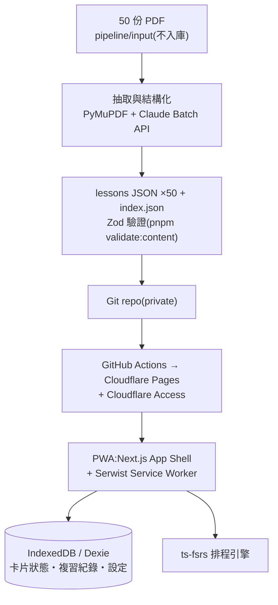

# ARCHITECTURE — 架構與技術決策

## 1. 三層架構



- **建置期**:PDF → JSON,一次性、人工觸發(Phase 5)。runtime 完全不接觸 PDF。
- **部署期**:`pnpm build` 產出 `out/`,GitHub Actions 推上 Cloudflare Pages。
- **執行期**:純前端 PWA。內容唯讀(靜態 JSON,SW 預快取);使用者狀態只存 IndexedDB。

## 2. 技術選型

### 執行期 App

| 層面 | 技術 | 理由 |
|---|---|---|
| 框架 | Next.js 15 App Router(`output: 'export'`) | 純靜態輸出,50 課頁面 SSG |
| 語言 | TypeScript(strict) | — |
| UI | Tailwind CSS + shadcn/ui | 一致、可控、不引入第二套元件庫 |
| PWA | Serwist(next-pwa 的後繼維護版) | service worker 生成、precache、更新策略 |
| 內容資料 | 靜態 JSON(`public/data/`) | 全量約 3–8 MB,SW 一次預快取後完全離線 |
| 使用者資料 | IndexedDB + Dexie.js | 卡片狀態、複習紀錄、進度、設定 |
| SRS | ts-fsrs(FSRS 演算法) | 排程效率優於 SM-2;logs 留存供日後 optimizer |
| 狀態管理 | Zustand | 輕量,只管複習 session 等 UI 狀態 |
| 日文處理 | WanaKana + 原生 `<ruby>` | 輸入正規化;furigana 由資料提供、不做 runtime 斷詞 |
| 客端搜尋 | MiniSearch | 跨課全文檢索,無後端 |
| 音訊 | Web Speech API(`ja-JP`) | 零成本 TTS;無可用 voice 時靜默降級 |
| 統計圖表 | Recharts | 熱力圖、到期預測、留存曲線 |
| 測試 | Vitest + @testing-library/react + fake-indexeddb | — |

### 建置期管線

| 步驟 | 工具 |
|---|---|
| 文字層偵測 / 抽取 / 頁面渲染 | PyMuPDF(Python 3.12,uv 管理) |
| 結構化抽取 | Claude API(Message Batches,掃描頁走 vision) |
| 最終驗證 | `pnpm validate:content`(Zod,單一真相) |

### 部署

GitHub Actions(CI:verify + build;CD:Cloudflare Pages)+ Cloudflare Access(存取控制,版權要求)。

## 3. 目錄結構(目標狀態)

```
├── CLAUDE.md / README.md / IMPLEMENTATION_PLAN.md
├── docs/                       # 本資料夾:規格與決策
├── .claude/skills/             # next-task、verify 工作流技能
├── pipeline/                   # Python,一次性(Phase 5)
│   ├── input/                  # 原始 PDF L01.pdf–L50.pdf(gitignored)
│   ├── work/                   # 中間產物(gitignored)
│   ├── review/                 # 驗證失敗待人工確認
│   ├── prompts/extract.md      # 抽取 prompt(版本控管)
│   └── extract.py              # CLI:--lesson N / --all / --batch
├── public/
│   ├── data/
│   │   ├── index.json          # 課程索引(generated)
│   │   └── lessons/L01.json…L50.json   # generated,手改禁止
│   ├── icons/
│   └── manifest.json
├── scripts/validate-content.ts # pnpm validate:content
└── src/
    ├── app/
    │   ├── layout.tsx          # 全域 shell + 底部導覽
    │   ├── page.tsx            # 導向 /lessons
    │   ├── lessons/            # F1(/lessons、/lessons/[id])
    │   ├── review/             # F2
    │   ├── quiz/[id]/          # F3
    │   ├── grammar/            # F4
    │   ├── stats/              # F5
    │   └── settings/           # F6
    ├── components/             # RubyText、BottomNav、RatingButtons…
    ├── lib/
    │   ├── content.ts          # 載入 + Zod parse + 記憶體快取
    │   ├── db.ts               # Dexie 定義(唯一 DB 入口)
    │   ├── srs.ts              # ts-fsrs 唯一入口
    │   ├── quiz.ts             # 出題引擎(純函式)
    │   ├── stats.ts            # 統計聚合(純函式 + DB 查詢)
    │   ├── tts.ts              # Web Speech API 包裝
    │   └── search.ts           # MiniSearch 索引建立與查詢
    ├── schemas/lesson.ts       # Zod:資料契約唯一真相
    └── sw.ts                   # Serwist service worker
```

## 4. 資料流

1. **內容**:`content.ts` fetch `/data/lessons/Lxx.json` → Zod parse → 記憶體快取。SW 已預快取,離線可得。
2. **學習狀態**:UI → `srs.ts`(ts-fsrs 計算)→ `db.ts`(Dexie 持久化)→ `stats.ts` 聚合 → 統計頁。
3. 內容與狀態以 `cardId`(= `VocabItem.id`)鬆耦合:內容重新產生不影響既有進度(見 DATA_MODEL §4 不變式)。

## 5. 關鍵決策(ADR 摘要)

| # | 決策 | 理由 |
|---|---|---|
| D1 | 內容於建置期抽取,runtime 無 PDF、無 pdf.js | 體積、離線、複雜度都單純 |
| D2 | `output: 'export'` 純靜態;禁 API routes / server actions | 免後端,任何靜態主機可部署 |
| D3 | Zod(`src/schemas/`)是資料契約唯一真相;Python 端只做寬鬆 shape 檢查 | 避免雙 schema 漂移;最終把關集中在 `validate:content` |
| D4 | furigana 於抽取期定稿為 ruby 分段;runtime 不用 kuroshiro 斷詞 | 教材讀音是 ground truth,斷詞器對教材詞彙會猜錯 |
| D5 | FSRS(ts-fsrs)取代 SM-2;複習 logs 全留 | 排程效率;之後可用個人紀錄跑 FSRS optimizer 調參 |
| D6 | 使用者資料僅存 IndexedDB;備援 = JSON 匯出/匯入 | 無後端前提下最簡可靠;同步留待 v2(Workers + D1) |
| D7 | repo 私有 + Cloudflare Access | 教材版權,內容不可公開存取 |
| D8 | 套件 API 不確定時一律查官方文件(Serwist / ts-fsrs / Dexie / Next 15) | 這幾個套件 API 迭代快,憑記憶實作風險高 |
