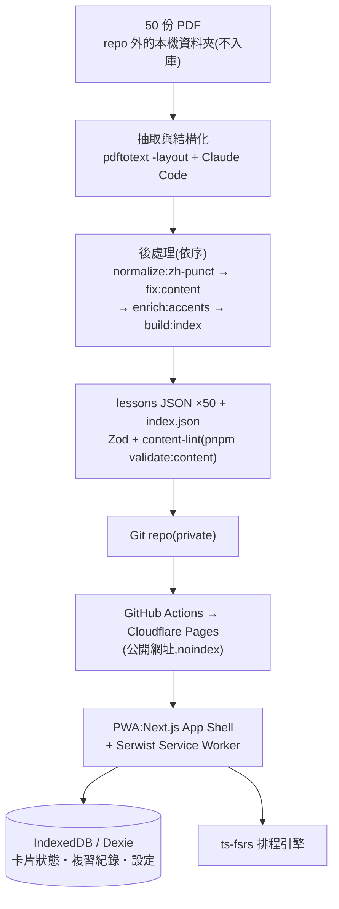

# ARCHITECTURE — 架構與技術決策

## 1. 三層架構


```mermaid
flowchart TD
  A["50 份 PDF<br/>repo 外的本機資料夾(不入庫)"] --> B["抽取與結構化<br/>pdftotext -layout + Claude Code"]
  B --> P["後處理(依序)<br/>normalize:zh-punct → fix:content<br/>→ enrich:accents → build:index"]
  P --> C["lessons JSON ×50 + index.json<br/>Zod + content-lint(pnpm validate:content)"]
  C --> D["Git repo(private)"]
  D --> E["GitHub Actions → Cloudflare Pages<br/>(公開網址,noindex)"]
  E --> F["PWA:Next.js App Shell<br/>+ Serwist Service Worker"]
  F --> G[("IndexedDB / Dexie<br/>卡片狀態・複習紀錄・設定")]
  F --> H["ts-fsrs 排程引擎"]
```

- **建置期**:PDF → JSON,一次性、人工觸發(Phase 5)。runtime 完全不接觸 PDF。
- **部署期**:`pnpm build` 產出 `out/`,GitHub Actions 推上 Cloudflare Pages。
- **執行期**:純前端 PWA。內容唯讀(靜態 JSON,SW 預快取);使用者狀態只存 IndexedDB。

## 2. 技術選型

### 執行期 App

| 層面 | 技術 | 理由 |
|---|---|---|
| 框架 | Next.js 15 App Router(`output: 'export'`) | 純靜態輸出,50 課頁面 SSG |
| 語言 | TypeScript(strict) | — |
| UI | Tailwind CSS + shadcn/ui | 一致、可控、不引入第二套元件庫;語意色彩 token 見 D9 |
| PWA | Serwist(next-pwa 的後繼維護版) | service worker 生成、precache、更新策略 |
| 內容資料 | 靜態 JSON(`public/data/`) | 全量約 3–8 MB,SW 一次預快取後完全離線 |
| 使用者資料 | IndexedDB + Dexie.js | 卡片狀態、複習紀錄、進度、設定 |
| SRS | ts-fsrs(FSRS 演算法) | 排程效率優於 SM-2;logs 留存供日後 optimizer |
| 狀態管理 | React state(`useState`) | 複習 session 等 UI 狀態只存在頁面內;持久狀態一律經 `db.ts` |
| 日文處理 | WanaKana + 原生 `<ruby>` | 輸入正規化;furigana 由資料提供、不做 runtime 斷詞 |
| 客端搜尋 | MiniSearch | 跨課全文檢索,無後端 |
| 音訊 | Web Speech API(`ja-JP`) | 零成本 TTS;語音清單非同步載入(`voiceschanged`,最多等 1.5 秒),優先裝置內建(`localService`)日語 voice;朗讀文字去除教材記號(［］〔〕（）〜…／);無可用 voice 時靜默降級 |
| 統計圖表 | Recharts | 熱力圖、到期預測、留存曲線 |
| 測試 | Vitest + @testing-library/react + fake-indexeddb | — |

### 建置期管線

PDF 皆含文字層,原規劃的 PyMuPDF + Claude Message Batches 改為下表(ADR 變更見 `docs/PIPELINE.md`)。表列順序即執行順序:日後從 PDF 重新抽取後依序跑 `normalize:zh-punct` → `fix:content` → `enrich:accents` → `build:index` → `validate:content`(理由見 PIPELINE §2「重新抽取後的步驟」)。

| 步驟 | 工具 |
|---|---|
| 文字層抽取 | `pdftotext -layout`(poppler) |
| 結構化抽取 | Claude Code 依 `docs/PIPELINE.md` 慣例直抽為 JSON;讀音由使用者人工校讀 |
| 中文標點 | `pnpm normalize:zh-punct`(`scripts/normalize-zh-punct.ts`):中文欄位(meaning、note(段落標記除外)、explanation、translation、dialogueTitle.translation)的標點規則式統一為全形(R1–R9 在 `scripts/lib/zhPunct.ts`,千分位保留;SPEC F1.6),以 `scripts/lib/rawJson.ts` 手術式寫回(以 id 行定位物件、只換目標字串,不整檔重寫)、冪等;先印摘要,`--check` 有待改項 exit 1。content-lint error zh-punct 與它共用規則,在 `pnpm verify` 把關 |
| 資料修正 | `pnpm fix:content`(`scripts/fix-content.ts`):不需 PDF 的修正以宣告式清單 `CORRECTIONS`(現值 from → 修正值 to + 理由;另有会話標題行移入 `dialogueTitle` 並遞補 D id,以及 ruby 分段——一段換成多段,串接的表面與讀音不變)同樣以 `scripts/lib/rawJson.ts` 手術式寫回,冪等;`--check` 只列狀態,有待套用項 exit 1。每筆由 `scripts/fix-content.data.test.ts` 在 `pnpm verify` 釘住 |
| 重音回填 | `pnpm enrich:accents`(kanjium,`scripts/enrich-accents.ts`) |
| 課程索引 | `pnpm build:index`(`scripts/build-index.ts`):由課程檔產生 `public/data/index.json`(title、vocabCount、grammarCount;content-lint index-match 核對) |
| 最終驗證 | `pnpm validate:content`(Zod,單一真相;通過後跑 content-lint `scripts/content-lint.ts`:error 規則失敗 exit 1,warning 只列出,`--all`/`--rule <id>` 印完整清單)。error 規則另由 `scripts/content-lint.data.test.ts` 在 `pnpm verify` 對真實資料執行 |

### 部署

GitHub Actions(CI:verify + build;CD:Cloudflare Pages)。部署為公開網址,以 noindex 降低曝光(見 D7)。

## 3. 目錄結構(目標狀態)

```
├── CLAUDE.md / README.md / IMPLEMENTATION_PLAN.md
├── docs/                       # 本資料夾:規格與決策
├── .claude/skills/             # next-task、verify 工作流技能
├── pipeline/                   # (未建立)原規劃的 Python 管線;input/、work/ 仍 gitignored,PDF 永不入庫
├── public/
│   ├── data/
│   │   ├── index.json          # 課程索引(generated)
│   │   └── lessons/L01.json…L50.json   # generated,手改禁止
│   ├── icons/
│   └── manifest.json
├── scripts/
│   ├── validate-content.ts     # pnpm validate:content(Zod + content-lint)
│   ├── content-lint.ts         # 內容 lint 規則(純函式;validate:content 與資料測試共用)
│   ├── build-index.ts          # pnpm build:index(index.json)
│   ├── enrich-accents.ts       # pnpm enrich:accents(重音回填)
│   ├── fix-content.ts          # pnpm fix:content(宣告式資料修正,手術式寫回 public/data)
│   ├── normalize-zh-punct.ts   # pnpm normalize:zh-punct(中文標點全形化,手術式寫回 public/data)
│   ├── lib/rawJson.ts          # 課程 JSON 手術式字串替換(不整檔重寫;fix-content、normalize-zh-punct 共用)
│   ├── lib/zhPunct.ts          # 中文標點規則 normalizeZhPunct 與中文欄位清單(normalize-zh-punct、content-lint 共用)
│   ├── lib/cli.ts              # 內容腳本 CLI 共用:isMain(以真實路徑判斷直接執行)、inFile(錯誤訊息標上檔名)
│   └── precache-entries.ts     # SW precache 條目(/data/**、public/)
└── src/
    ├── app/
    │   ├── layout.tsx          # 全域 shell + 底部導覽
    │   ├── page.tsx            # 今日儀表板(佇列 Hero、今日目標、安裝提示;資料層動態載入)
    │   ├── lessons/            # F1(/lessons、/lessons/[id])
    │   ├── review/             # F2
    │   ├── practice/           # 頑固卡(leech)練習(T8.2;純曝光,不改 FSRS 排程)
    │   ├── quiz/[id]/          # F3:題型選擇(日→中/中→日/輸入/例句填空/聽力,存於設定 quizTypes)→ 10 題 → 結果(/quiz 頂端「練習」區塊連到各練習)
    │   ├── drill/              # F7.3 活用練習、F7.5 助詞搭配(/drill,?mode=particle:類型、範圍(與形)→ 10 題 → 結果;不寫入 DB)
    │   ├── reorder/            # F7.4 例句重組(/reorder 選課、/reorder/[id]:至多 8 句 → 結果;不寫入 DB)
    │   ├── grammar/            # F4
    │   ├── stats/              # F5
    │   └── settings/           # F6
    ├── components/             # RubyText、BottomNav、RatingButtons…
    │   └── ui/button.tsx       # shadcn 樣式 Button / buttonVariants(手寫,無 asChild/radix)
    ├── lib/
    │   ├── content.ts          # 載入 + Zod parse + 記憶體快取
    │   ├── db.ts               # Dexie 定義(唯一 DB 入口)
    │   ├── backup.ts           # 匯出/匯入(單一 JSON;驗 version 與頂層結構)/重置學習紀錄(保留設定)
    │   ├── srs.ts              # ts-fsrs 唯一入口
    │   ├── cardId.ts           # cardId / 方向工具(baseVocabId 等;不依賴 ts-fsrs,srs 轉匯出)
    │   ├── relearn.ts          # 複習 session 內重看的插入規則(純函式)
    │   ├── notes.ts            # 單字 note 呈現:段落標記過濾與徽章分類、補充單字判定(純函式)
    │   ├── lessonHash.ts       # 課程內頁 URL hash:分頁與文法/單字錨點解析(純函式)
    │   ├── urlParams.ts        # app 查詢參數(/drill?upto=N&mode=particle)與 SW precache 查找時忽略的參數(sw.ts 共用)
    │   ├── vocabFilter.ts      # 課程頁単語的詞性篩選:13 種詞性併為 名詞/動詞/形容詞/其他(純函式)
    │   ├── dialogue.ts         # 会話朗讀與角色扮演:說話者、播放步驟 speak/wait(純函式;会話標題在 Lesson.dialogueTitle,不在 dialogues)
    │   ├── conjugate.ts        # 活用引擎:動詞/形容詞基本形與進階形(可能…使役、條件形)推導(例外表、排除清單)、各形導入文法點 FORM_INTRO(純函式)
    │   ├── conjugateExclusions.ts # 進階形的語意排除清單(id → 不練的形與理由;寧缺勿錯)
    │   ├── drill.ts            # 活用練習:出題池、依範圍開放的形、錯誤規則與易混淆形干擾項、出題與判分(純函式)
    │   ├── particles.ts        # 助詞搭配:解析單字 note 的教材搭配(〔たばこを〜〕〔〜を します〕)、出題池、選項(同義也自然的助詞不當干擾項 ALSO_NATURAL)與回合(純函式)
    │   ├── reorder.ts          # 例句重組:依分かち書き切塊(併回抽取痕跡的空格)、可否出題、各課出題池、固定首尾的打亂、以塊文字判分(純函式)
    │   ├── lang.ts             # isJapanese / jaLang:日文字串的 lang="ja" 判定(純函式)
    │   ├── pitch.ts            # 東京式重音:拍分割與高低型(純函式;資料由 enrich-accents 回填)
    │   ├── pwa.ts              # PWA 環境判定、storage.persist()(永不 throw)
    │   ├── utils.ts            # cn():合併 Tailwind class(shadcn 慣例)
    │   ├── useTapGuard.ts      # 點擊防護(TAP_GUARD_MS 300ms):換題/作答/進結果頁後忽略雙擊的第二下(useShownAt 於 layout 階段起算、結果頁 useEntryClickGuard)
    │   ├── scroll.ts           # revealAboveNav:「下一題」被固定的底部導覽列擋住時捲出來
    │   ├── queueNote.ts        # 今日佇列因每日上限而空時的說明(純函式;首頁、課程頁共用)
    │   ├── studyDay.ts         # 學習日(凌晨 4 點換日)與 ts-fsrs 時間平移(純函式)
    │   ├── quiz.ts             # 出題引擎:選擇/輸入/例句填空(挖空)/聽力題型、干擾項(聽力、填空排除可互換的字)、輸入判分、聽力朗讀文字(純函式)
    │   ├── examples.ts         # 語境例句:詞邊界比對找同課例句(findExampleSentence;findExampleMatch 另回傳位置與比對種類 exact/conjugated,例句填空只用 exact);動詞全課無ます形時改比對 conjugate.ts 推導的活用形(分かち書き詞首、右邊界、讀音一致;一字語幹/同課同形字須 note 搭配名詞)(純函式)
    │   ├── stats.ts            # 統計聚合(純函式 + DB 查詢)
    │   ├── tts.ts              # Web Speech API 包裝(speak、可取消的連續朗讀 speakSequence)+ 朗讀文字清理(speechText)
    │   ├── useSetting.ts       # 讀取全域設定的 hook(useSetting / useTtsEnabled;經 db.ts)與日語語音可用性(useJaVoiceAvailable)
    │   └── search.ts           # MiniSearch 索引建立與查詢
    ├── schemas/lesson.ts       # Zod:資料契約唯一真相
    ├── test/                   # 測試共用 helper(時鐘與點擊防護、長計時器、焦點等待、底部導覽遮擋、慢測試逾時)
    └── sw.ts                   # Serwist service worker(precache 查找忽略 _rsc 與 app 查詢參數,離線可開帶參數的網址)
```

## 4. 資料流

1. **內容**:`content.ts` fetch `/data/lessons/Lxx.json` → Zod parse → 記憶體快取。SW 已預快取,離線可得。
2. **學習狀態**:UI → `srs.ts`(ts-fsrs 計算)→ `db.ts`(Dexie 持久化)→ `stats.ts` 聚合 → 統計頁。
3. 內容與狀態以 `cardId`(= `VocabItem.id`)鬆耦合:內容重新產生不影響既有進度(見 DATA_MODEL §4 不變式)。

## 5. 關鍵決策(ADR 摘要)

| # | 決策 | 理由 |
|---|---|---|
| D1 | 內容於建置期抽取,runtime 無 PDF、無 pdf.js | 體積、離線、複雜度都單純 |
| D2 | `output: 'export'` 純靜態;禁 API routes / server actions | 免後端,任何靜態主機可部署 |
| D3 | Zod(`src/schemas/`)是資料契約唯一真相;Python 端只做寬鬆 shape 檢查 | 避免雙 schema 漂移;最終把關集中在 `validate:content` |
| D4 | furigana 於抽取期定稿為 ruby 分段;runtime 不用 kuroshiro 斷詞 | 教材讀音是 ground truth,斷詞器對教材詞彙會猜錯 |
| D5 | FSRS(ts-fsrs)取代 SM-2;複習 logs 全留 | 排程效率;之後可用個人紀錄跑 FSRS optimizer 調參 |
| D6 | 使用者資料僅存 IndexedDB;備援 = JSON 匯出/匯入 | 無後端前提下最簡可靠;同步留待 v2(Workers + D1) |
| D7 | repo 私有;部署公開 + noindex(2026-07-10 修訂,原方案為 Cloudflare Access) | 使用者要求免登入直接使用並自承版權風險;以 noindex 與不散佈網址降低曝光 |
| D8 | 套件 API 不確定時一律查官方文件(Serwist / ts-fsrs / Dexie / Next 15) | 這幾個套件 API 迭代快,憑記憶實作風險高 |
| D9 | 色彩一律用 `globals.css` 的 shadcn 命名語意 token(`bg-card`、`text-muted-foreground`、`text-link`…),淺色值在 `:root`、深色值在 `@media (prefers-color-scheme: dark)`;不用 `.dark` class、不跑 `shadcn init`,元件手寫加入 | 跟隨系統配色、零 JS;`shadcn init` 會改用 `.dark` class 並使深色失效。文字 token 在 background/card 上對比 ≥ 4.5:1(兩種配色);`themeColor` 依配色分兩值,manifest 只能一值故用淺色 primary;`src/app/theme.test.ts` 驗對比並掃描原始碼禁止寫死色票 |
